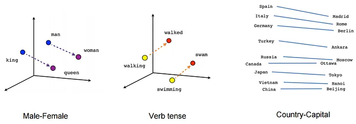
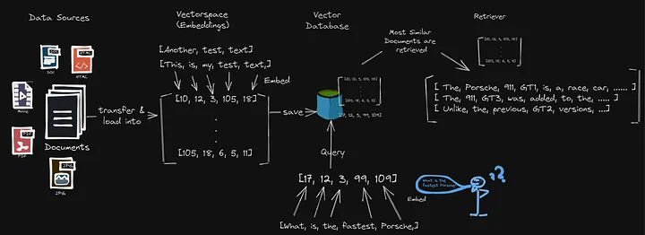

# Medium Repo

This repository will store all my activities and code snippets I use on Medium. You can follow me on Medium to get the latets updates: 
[Medium - Christian Bernecker](https://medium.com/@christianbernecker)

# Natural Language Processing - NLP

## Semantic Search with Embeddings

Explore the world of semantic similarity search using pretrained word embeddings with BERT Transformers in this code snippet. The example demonstrates how to compute and compare sentence embeddings, enabling semantic search for related content.

The corresponding articel you will find here:
[NLP SIMILARITY: Use pretrained word embeddings for semantic similarity search with BERT Transformers](https://medium.com/@christianbernecker/nlp-similarity-use-pretrained-word-embeddings-for-semantic-similarity-search-with-bert-4beaf7b6a148)

1. Create Sentence Embeddings: Utilize pretrained BERT Transformers to encode sentences into numerical representations.
2. Compute Similarities: Use cosine similarity to measure the similarity between sentence embeddings.

You can find the notebook here: [Word Embeddings](word_embeddings.ipynb)

## Semantic Search with Embeddings + Vector Database 

Explore the power of semantic search using vector embeddings in this project. The example focuses on converting text data related to the Porsche 911 Wikipedia page into numerical representations. These embeddings are then ingested into a vector database, enabling users to perform similarity searches and discover related content based on the Porsche 911 Wikipedia page.

The corresponding articel you will find here:
[NLP SIMILARITY 2: Use Vector Databases and word embeddings of LLM for semantic similarity search](https://medium.com/@christianbernecker/nlp-similarity-2-use-vector-databases-and-word-embeddings-of-llm-for-semantic-similarity-search-12514d78d88c)

1. **Load Dataset:** Retrieve the Wikipedia page for the Porsche 911 and preprocess it for analysis.
2. **Split Documents:** Divide the HTML page into subsections using headers for segmentation.
3. **Create Embeddings:** Save data as word embeddings in ChromaDB using the Sentence-Transformers library.
4. **Semantic Search:** Utilize vector embeddings to find sections in the document that can answer specific questions.

You can find the notebook here: [Semantic Search](semantic_search.ipynb)

## Semantic Search with Embeddings + Vector Database + LLM -> Simple Question Answering System - RAG

")

This project guides you through building a basic question-answering system using Python. The hands-on project covers essential steps such as defining prompt templates, integrating language models, and implementing retrieval mechanisms to fetch information. 

The corresponding articel you will find here:
[NLP Question Answering: Answer questions with a local LLM and a vector database on your own embedded data](https://medium.com/@christianbernecker/nlp-question-answering-answer-questions-with-a-local-llm-and-a-vector-database-on-your-own-adfd876eb48f)

1. **Load Dataset:** Retrieve a Wikipedia page (e.g., Porsche 911) and preprocess it for analysis.
2. **Split Documents:** Divide the HTML page into subsections using headers for segmentation.
3. **Create Embeddings:** Save data as word embeddings in ChromaDB using the Sentence-Transformers library.
4. **Initialize Local LLM Model:** Load a local Large Language Model for answering questions.
5. **Question-Answering Chain:** Utilize the integrated components to answer specific queries with contextual information.

You can find the notebook here: [RAG Question Answering System](question_answering_rag.ipynb)
If you want to use OpenAI you can jump to the following notebook: [RAG Question Answering System with OpenAI](question_answering_rag_openAI.ipynb)

